# Node.js Compatibility Analysis

This document provides a comprehensive analysis of Node.js version compatibility for the cURL Runner project, including the investigation process, findings, and visual representations using Mermaid diagrams.

## 🔍 Investigation Process

### Initial Assessment
The project initially had `"engines": { "node": ">=14.0.0" }` in package.json, but this was found to be incorrect after analyzing the actual features used.

### Feature Analysis
We systematically analyzed each feature used in the project to determine the true minimum Node.js version requirements.

## 📊 Version Compatibility Matrix


## 🎯 Compatibility Timeline


## 🔧 Feature Dependency Graph

```mermaid
graph LR
    A[Project Features] --> B[ES Modules]
    A --> C[Testing Framework]
    A --> D[Core APIs]
    A --> E[External Dependencies]
    
    B --> B1[import/export syntax]
    B --> B2[package.json type: module]
    
    C --> C1[node:test]
    C --> C2[node:assert]
    C --> C3[Test Runner Commands]
    
    D --> D1[fs module]
    D --> D2[path module]
    D --> D3[child_process module]
    D --> D4[process object]
    
    E --> E1[chalk ^5.3.0]
    E --> E2[commander ^11.1.0]
    E --> E3[c8 ^10.1.3]
    
    C1 --> F[Requires Node.js 18.0.0+]
    C2 --> F
    
    style F fill:#ff6b6b,stroke:#333,stroke-width:3px
    style C1 fill:#ff6b6b
    style C2 fill:#ff6b6b
```



## 📈 Version Support Status


## 🚀 Migration Path

```mermaid
flowchart TD
    A[Current Setup] --> B{Node.js Version Check}
    B -->|"< 18.0.0"| C[❌ Incompatible]
    B -->|"18.0.0+"| D[✅ Compatible]
    
    C --> E[Upgrade Required]
    E --> F[Install Node.js 18.0.0+]
    F --> G[Update package.json]
    G --> H[Test Application]
    H --> D
    
    D --> I[Verify Features]
    I --> J[ES Modules Working]
    I --> K[Test Runner Working]
    I --> L[Dependencies Working]
    
    J --> M[✅ Ready to Use]
    K --> M
    L --> M
    
    style C fill:#ff6b6b
    style E fill:#ffa726
    style D fill:#4caf50
    style M fill:#4caf50
```



## 🔍 Detailed Feature Analysis

### ES Modules Support


### Built-in Test Runner


### Dependencies Compatibility


## 📋 Testing Results

### Current Environment
- **Node.js Version**: v22.18.0
- **ES Modules**: ✅ Working
- **Built-in Test Runner**: ✅ Available
- **Built-in Assert**: ✅ Available
- **Dependencies**: ✅ All compatible

### Verification Commands
```bash
# Check Node.js version
node --version
# Output: v22.18.0

# Test built-in modules
node -e "console.log('Test runner:', typeof require('node:test'));"
# Output: Test runner: object

# Test ES modules
node -e "console.log('ES modules:', process.versions.node >= '18.0.0');"
# Output: ES modules: true
```

## 🎯 Final Recommendations

### Minimum Version
- **Node.js 18.0.0** - Required for built-in test runner and assert module

### Recommended Versions
- **Node.js 18.x** - LTS version with long-term support
- **Node.js 20.x** - Current LTS version
- **Node.js 22.x** - Latest version with all features

### Package.json Update
```json
{
  "engines": {
    "node": ">=18.0.0"
  }
}
```

## 📚 Related Documentation

- [Node.js Version Requirements](NODE_VERSION_REQUIREMENTS.md) - Detailed technical analysis
- [Separation of Concerns](SEPARATION_OF_CONCERNS.md) - Project architecture
- [Test Mocking Update](TEST_MOCKING_UPDATE.md) - Testing framework details

## 🔄 Update History

| Date | Change | Details |
|------|--------|---------|
| 2025-01-05 | Initial Analysis | Discovered minimum version is 18.0.0, not 14.0.0 |
| 2025-01-05 | Package.json Update | Updated engines field to >=18.0.0 |
| 2025-01-05 | Documentation | Created comprehensive compatibility analysis |
| 2025-01-05 | Mermaid Diagrams | Added visual representations of compatibility |

## 🎉 Conclusion

The cURL Runner project requires **Node.js 18.0.0 or higher** due to its use of the built-in test runner (`node:test`) and built-in assert module (`node:assert`). While ES modules and dependencies support earlier versions, the testing framework is the limiting factor that determines the minimum version requirement.

The project is fully compatible with all Node.js versions from 18.0.0 to the latest 22.x, making it suitable for both LTS and current Node.js environments.